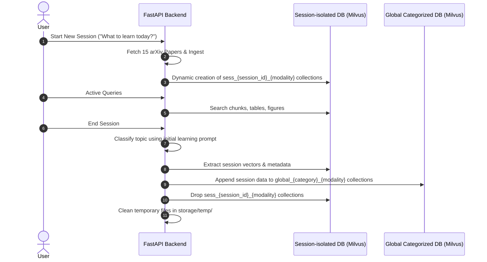

# FactChat: Finalized Agentic & Session-Dynamic RAG Implementation Plan

This document defines the production blueprint and execution roadmap to transition **FactChat** to an agentic RAG and session-dynamic database architecture. It incorporates resolved design decisions on transparent refetching, topic-based categorization, and interactive recommendation triggers.

---

## 1. System Objectives & Architecture

FactChat isolates search spaces dynamically on a per-session basis to ensure low latency and hyper-relevant context.

```mermaid
graph TD
    User([User Request]) --> NewSession{New Chat?}

    %% New Session Flow
    NewSession -- Yes --> PromptTopic[Prompt: "What to learn today?"]
    PromptTopic --> FetchPapers[Fetch 15 relevant papers via arXiv XML API]
    FetchPapers --> TempDownload[Download PDFs to storage/temp/]
    TempDownload --> ParseEmbed[Parse using Docling & Embed using FastEmbed]
    ParseEmbed --> CreateSessionDB[Create Session-ID collections in Milvus]

    %% Active Session Flow
    NewSession -- No (Resume) --> UseGlobalDB[Use Categorized Global DB as primary source]

    %% Agentic Processing
    CreateSessionDB --> AgenticRouting[LangGraph Agent Coordinator & Core Agents]
    UseGlobalDB --> AgenticRouting
```

---

## 2. Finalized Design Decisions

Based on design alignment, the following operations are finalized:

- **Agent Orchestration**: Multi-agent routing and conditional flows (refetch loops, `@agent` branches) are implemented with **LangGraph** (`StateGraph`). **LangChain** supplies LLM clients (`ChatOpenAI` via `langchain-openai`), prompts, and optional tools (GitHub, arXiv). FastAPI remains the HTTP boundary; vector search stays on **FastEmbed + Milvus** (`HybridRetriever`), not LangChain vector stores.
- **Refetch Agent Flow**: The Refetch Agent runs **completely transparently** as part of the Retrieval Agent chain. If context relevance is low, it dynamically fetches and indexes 1–2 new papers without interrupting the conversation with prompt gates.
- **Session Categorization**: Categorization into global databases (AI, Healthcare, Social, Law, or General) is determined directly from the **initial compulsory topic input**: _"What do you want to learn today?"_. This prevents drift and simplifies global consolidation upon session end.
- **Drift & Vagueness Recommendation**: The Recommendation Agent monitors query themes against the initial topic. If subsequent queries drift significantly or become too vague relative to the original source corpus, it explicitly recommends that the user **start a new session** rather than attempting to stretch the current index.

---

## 3. Detailed Agent System Specifications

### 3.0. Agent Orchestration Stack (LangGraph + LangChain)

FactChat’s query pipeline is a compiled **LangGraph** `StateGraph` invoked from `app/agents/agent_coordinator.py`. **LangChain** wraps OpenAI chat models and tool bindings; ingestion and Milvus indexing are unchanged.

| Layer         | Technology         | Responsibility                                               |
| ------------- | ------------------ | ------------------------------------------------------------ |
| HTTP API      | FastAPI            | Sessions, ingestion triggers, `POST /chat/query`             |
| Orchestration | **LangGraph**      | Typed graph state, node execution order, conditional edges   |
| LLM & tools   | **LangChain**      | `ChatOpenAI` (`OPENAI_API_KEY`), prompts, GitHub/arXiv tools |
| Retrieval     | FastEmbed + Milvus | `HybridRetriever`; not replaced by LangChain retrievers      |

**Default graph path** (no `@agent` tag): `route_input` → `retrieve` → (`refetch` if top score < 0.65 or empty, then retry `retrieve`) → `repo_enrich` → `recommend` → `synthesize_answer`.

**Callable branches** (`@buddy`, `@review`, `@writer`): conditional edges from `route_input` skip the default RAG path.

**Dependencies** (Phase 3): `langgraph`, `langchain`, `langchain-openai`.

```mermaid
flowchart TD
    UserQuery([User Input]) --> Coordinator[Agent Coordinator - LangGraph StateGraph]

    subgraph Core System Agents (Powered by gpt-5-nano)
        Coordinator --> Retriever[Retriever Agent]
        Coordinator --> Repo[Repo Agent]
        Coordinator --> Refetch[Refetch Agent]
        Coordinator --> Recommender[Recommendation Agent]
    end

    subgraph Callable Agents: Trigger via @agent (Powered by gpt-5-mini)
        Buddy[Buddy Agent <br> '@buddy']
        Reviewer[Review Agent <br> '@review']
        Writer[Writer Agent <br> '@writer']
    end

    Retriever --> |Query active index & cite| Response[Formatted Output + Citations]
    Repo --> |Scrape linked repositories| Response
    Refetch --> |Relevance low? Auto-inject 1-2 papers| Retriever
    Recommender --> |Suggest follow-ups & detect drift| Response

    UserQuery -->|Explicit tag| Buddy --> |Boilerplate code generation| Response
    UserQuery -->|Explicit tag| Reviewer --> |Scientific summary & critique| Response
    UserQuery -->|Explicit tag| Writer --> |Build comprehensive documentation| Response
```

### 3.1. Core Agents (`gpt-5-nano` powered)

1. **Retriever Agent**: Generates query embeddings, searches the active database (session-specific or global category), merges chunks, tables, and figures, and formats inline citations (e.g., `[C1]`).
2. **Repo Agent**: Analyzes retrieved segments for GitHub repo patterns. If references are found, it queries the GitHub API via `httpx` to obtain metadata, structures, and links to present alongside citations.
3. **Refetch Agent**: Monitors similarity scores during retrieval. If scores fall below `0.65` (or no segments are found), it queries arXiv for 1–2 highly relevant papers, executes a micro-ingestion pipeline (download, Docling parse, FastEmbed, and Milvus insertion), and prompts a retrieval retry.
4. **Recommendation Agent**: Formulates standard follow-up questions, suggest callable agent actions, and triggers a recommendation to start a new chat session if conversation drift or query vagueness is detected.

### 3.2. Callable Agents (`gpt-5-mini` powered)

- **Buddy Agent (`@buddy`)**: Generates production-ready boilerplate code and implementations based on techniques and algorithms outlined in the source papers, using a secure code execution sandbox to test and self-correct the generated code before delivering it to the user.
- **Review Agent (`@review`)**: Performs a critique of the active conversation thread and source context to construct a formal scientific review.
- **Writer Agent (`@writer`)**: Synthesizes the session's logs and data into structured Markdown technical documentation, and compiles it into a downloadable Word (.docx) file.

### 3.3. Primary LLM Answering Model (`gpt-5-mini` powered)

- Responsible for compiling final RAG-grounded responses when no custom callable agent tags are invoked.
- Implemented as a LangGraph terminal node using LangChain **`ChatOpenAI`** pointed at the official, non-proxied **OpenAI API** (`OPENAI_API_KEY`). Replaces the legacy OpenRouter answer service.

---

## 4. Session Vector DB Lifecycle



---

## 5. Phased Implementation Roadmap

### Phase 1: Database Refactoring & Dynamic Session Management

- Refactor [milvus_store.py](file:///d:/GroundTruth%20AI/app/vectorstores/milvus_store.py) to dynamically index and provision collections using session-prefixed identifiers: `sess_{session_id}_chunks`, `sess_{session_id}_tables`, and `sess_{session_id}_figures`.
- Implement a merge pipeline to copy records from active session collections to global category collections (`global_ai_*`, `global_healthcare_*`, etc.) upon ending a session.
- Add drop routines to dynamically tear down dynamic collections.

### Phase 2: Simplified PDF Ingestion & Reference Mapping

- Restrict [arxiv_client.py](file:///d:/GroundTruth%20AI/app/services/arxiv_client.py) to arXiv API fetching. Remove Hugging Face search routines.
- Update ingestion to save documents under temporary directories (`storage/temp/`).
- Refactor [docling_parser.py](file:///d:/GroundTruth%20AI/app/parsers/docling_parser.py) to bypass Groq visual summaries. Integrate text-reference mapping to extract paragraph strings like `Fig. \d+` or `Table \d+` and associate them directly with extracted assets.

### Phase 3: Core Agent Cohort (`gpt-5-nano`) + LangGraph

- Add `langgraph`, `langchain`, and `langchain-openai` to `requirements.txt`.
- Implement `app/agents/graph.py`: LangGraph `StateGraph` with shared state (`session_id`, `category`, retrieval hits, relevance scores, refetch count, recommendations).
- Implement the core agent system in `app/agents/`:
  - `agent_coordinator.py`: Compiles and invokes the LangGraph; entry point for `POST /chat/query`.
  - `retriever_agent.py`: LangGraph node wrapping `HybridRetriever` (vector search and citation labeling).
  - `repo_agent.py`: LangGraph node; GitHub metadata via LangChain tools or `httpx`.
  - `refetch_agent.py`: Conditional node; transparent micro-ingest of 1–2 papers when relevance is low, then edge back to `retrieve`.
  - `recommendation_agent.py`: LangGraph node for follow-ups, drift/vagueness detection, and new-session prompts.
- Migrate final answer generation from OpenRouter to LangChain `ChatOpenAI` (OpenAI API, `gpt-5-mini`).

### Phase 4: Callable Specialty Agents (`gpt-5-mini`)

- Extend the LangGraph in `app/agents/graph.py` with conditional branches for `@agent` handles.
- Build specialized callable modules in `app/agents/callable_agents.py` to trigger on user handles:
  - `@buddy` (boilerplate logic code writer backed by a secure local code execution sandbox for verification and self-correction).
  - `@review` (scientific critiquing).
  - `@writer` (technical document compiler that outputs structured Markdown and compiles a Word .docx document).

### Phase 5: FastAPI Router Refactoring & System Verification

- Refactor [chat.py](file:///d:/GroundTruth%20AI/app/api/routes/chat.py) and [papers.py](file:///d:/GroundTruth%20AI/app/api/routes/papers.py) to expose session management endpoints:
  - `POST /chat/sessions`: Required body `{"topic": "..."}` prompts 15 arXiv paper ingestion and provisions session indexes.
  - `POST /chat/query`: Intercepts `session_id` and routes through the LangGraph `AgentCoordinator`.
  - `POST /chat/sessions/{session_id}/end`: Merges session indices to categorized global tables based on the initial topic, drops session tables, and deletes temporary files.
- Construct full-pipeline integration tests under `tests/test_session_flow.py` verifying index lifecycle and agent coordination.
