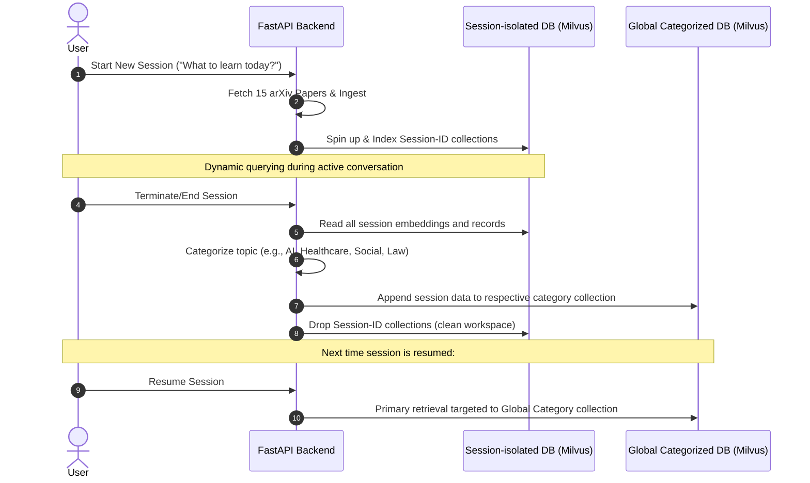

# FactChat: Revised Agentic System Scope

This document defines the updated architecture, features, and pipelines for the **FactChat** science-backed research assistant. This scope replaces the previous design with an agentic, session-dynamic RAG architecture.

---

## 1. System Flow & Architecture Overview

The revised FactChat system centers around **Session-isolated Vector Databases** that merge into **Categorized Global Databases** upon session completion. Chat queries are mediated by a **LangGraph**-orchestrated multi-agent system with **LangChain** LLM and tool primitives.

```mermaid
graph TD
    User([User Request]) --> NewSession{New Chat?}

    %% New Session Flow
    NewSession -- Yes --> PromptTopic[Prompt: "What to learn today?"]
    PromptTopic --> FetchPapers[Fetch 15 relevant papers via arXiv XML API]
    FetchPapers --> TempDownload[Download PDFs to temp folder]
    TempDownload --> ParseEmbed[Parse text/tables/figs & Embed using FastEmbed]
    ParseEmbed --> CreateSessionDB[Create Session-ID Vector DB in Milvus]

    %% Active Session Flow
    NewSession -- No (Resume) --> UseGlobalDB[Use Categorized Global DB as primary source]

    %% Agentic Processing
    CreateSessionDB --> AgenticRouting[LangGraph Agent Coordinator & Core Agents]
    UseGlobalDB --> AgenticRouting
```

---

## 2. Updated Core Functional Requirements

### 2.1. Simplified Ingestion & Image Mapping

- **Single Fetch Source**: Only query the **arXiv API** (returning XML metadata and PDF download links). Remove the Hugging Face client.
- **Temporary Storage**: Download paper PDFs into a designated local temporary folder (`storage/temp/`) during the session's active ingestion phase.
- **Bypassing Groq Enrichment**: Do not run figure-description or table-summary generation through Groq.
- **Implicit Image Reference Mapping**: Extract figure and table blocks using Docling. Since figures are referred to in paper text as e.g., `"Fig. 1"`, `"Figure 3"`, or `"Table 2"`, parser/retriever logic will extract nearby references and map these labels directly to the extracted image files/tables.

---

## 3. Agentic Architecture & Collaboration Model

The conversation and tasks are carried out by a coordinated cohort of specialized agents compiled as a **LangGraph** `StateGraph`. **LangChain** provides `ChatOpenAI` bindings, prompts, and optional tools (GitHub, arXiv). Vector retrieval remains on **FastEmbed + Milvus**; LangChain is not used as the vector store.

### 3.0. Orchestration Stack (LangGraph + LangChain)

| Component     | Role                                                                                                                                                                                    |
| ------------- | --------------------------------------------------------------------------------------------------------------------------------------------------------------------------------------- |
| **LangGraph** | Defines nodes (Retriever, Refetch, Repo, Recommendation, synthesis), shared state, and conditional edges (low relevance → refetch → retry retrieve; `@agent` tags → callable branches). |
| **LangChain** | OpenAI chat models (`langchain-openai`), prompt templates, tool wrappers.                                                                                                               |
| **FastAPI**   | HTTP API; invokes the compiled graph from `app/agents/agent_coordinator.py`.                                                                                                            |

**Default query path**: `route_input` → `retrieve` → (`refetch` if needed) → `repo_enrich` → `recommend` → `synthesize_answer`.

```mermaid
flowchart TD
    UserQuery([User Input]) --> Coordinator[Agent Coordinator - LangGraph StateGraph]

    subgraph Core System Agents
        Coordinator --> RetAgent[Retriever Agent]
        Coordinator --> RepoAgent[Repo Agent]
        Coordinator --> RefetchAgent[Refetch Agent]
        Coordinator --> RecAgent[Recommendation Agent]
    end

    subgraph Callable Agents: Call via @agent
        Buddy[Buddy Agent <br> '@buddy']
        Reviewer[Review Agent <br> '@review']
        Writer[Writer Agent <br> '@writer']
    end

    RetAgent --> |Fetch academic papers & cite| Response[Formatted Response with Citations]
    RepoAgent --> |Identify & fetch linked GitHub repos| Response
    RefetchAgent --> |Low relevance score? Ingest 1-2 new papers| RetAgent
    RecAgent --> |Suggest follow-ups & detect drift| Response

    UserQuery -->|Explicit tag| Buddy --> |Generate implementation boilerplate| Response
    UserQuery -->|Explicit tag| Reviewer --> |Generate critical summary of chat & sources| Response
    UserQuery -->|Explicit tag| Writer --> |Build comprehensive documentation| Response
```

### 3.1. Core Agents (Always Active - Powered by `gpt-5-nano`)

1. **Retriever Agent**: Responsible for querying the active vector database (session-based or primary global) and retrieving ground-truth paper segments to construct citation-grounded answers. Powered by the high-speed **`gpt-5-nano`** model.
2. **Repo Agent**: Scans retrieved paper contents, abstracts, and metadata to identify external linked code repositories (such as GitHub references). It fetches repository metadata, structures, and links to present as references for the user (no repository code ingestion takes place). Powered by **`gpt-5-nano`**.
3. **Recommendation Agent**: Analyzes user intent, details next logical research or development steps, and recommends specific follow-up actions or alerts the user of helpful callable agents. Powered by **`gpt-5-nano`**.
4. **Refetch Agent**: Operates concurrently during the retrieval loop. It assesses the user query alongside the relevance scores of the retrieved database hits. If the top relevance score falls below a minimum confidence threshold, it queries arXiv for 1–2 additional relevant papers, triggers the full ingestion pipeline for them, and prompts the Retriever Agent to re-run the search on the updated index. Powered by **`gpt-5-nano`**.

### 3.2. Callable Agents (Triggered by `@agent` triggers - Powered by `gpt-5-mini`)

- **Buddy Agent (`@buddy`)**: A boilerplate coding companion. It helps the user draft prototype implementations or code snippets for the methods, architectures, or equations discussed in the papers, using a secure code execution sandbox to run, verify, and self-correct the generated code before delivering it. Powered by the highly competent **`gpt-5-mini`** model.
- **Review Agent (`@review`)**: A critical evaluation agent. It reviews the entire active chat history, query results, and paper sources to produce a comprehensive scientific review or critique. Powered by **`gpt-5-mini`**.
- **Writer Agent (`@writer`)**: A documentation compiler. It builds formal, extensive documentation, reports, or research summaries based on the gathered findings, compiling the final text into a downloadable Word (.docx) document. Powered by **`gpt-5-mini`**.

### 3.3. LLM API Infrastructure

- **Direct Integration**: Switch entirely from OpenRouter to the **OpenAI API**.
- **LangChain Client**: Use `langchain-openai` `ChatOpenAI` with `OPENAI_API_KEY` for all agent and synthesis nodes.
- **API Key Config**: Configure `OPENAI_API_KEY` for authentication.
- **Core Answering Model**: The primary conversational engine (`synthesize_answer` LangGraph node) compiles final RAG-grounded responses using **`gpt-5-mini`**.
- **Dependencies**: `langgraph`, `langchain`, `langchain-openai` (see Phase 3 in `Implementation.md`).

---

## 4. Session Vector DB Lifecycle

FactChat isolates search space dynamically on a per-chat session basis to maintain hyper-relevant results and extremely low latency.



### 4.1. Lifecycle Mechanics

- **Session Initialization**:
  - Creating a new chat requires answering: _"What would you like to learn today?"_
  - The system pulls 15 relevant research papers matching this topic from arXiv.
  - An isolated, temporary vector index identified by the `session_id` is created in Milvus. All 15 papers' chunks, tables, and mapped figures are indexed here.
- **Session Termination (Active $\rightarrow$ Global)**:
  - When a session ends, the backend automatically classifies the session's topic into one of the global domains:
    - **AI**
    - **Healthcare**
    - **Social**
    - **Law**
    - _Other custom global categories_
  - The session's vectors and metadata are appended to the corresponding global collection.
  - The temporary session-isolated database is deleted.
- **Session Resumption**:
  - If the user returns to a past, closed session, the system bypasses creating a new session DB and queries the categorized **Global Vector DB** as its primary retrieval store.

---

## 5. Citations and Sources Rules

Every single statement made by the chat interface or active agent must explicitly link back to its supporting paper segment.

- **Citation Formats**:
  - Inline tags matching retrieval citations: `[C1] (Paper Title, Page X)`.
  - External repo references retrieved by the **Repo Agent**: `[Repo] (github.com/user/repo)`.
- **Accuracy Guardrails**: If no indexed evidence exists in the vector store for a specific question, the Retriever Agent must output: _"I could not find indexed evidence for that question in the active sources."_ rather than attempting to speculate.
